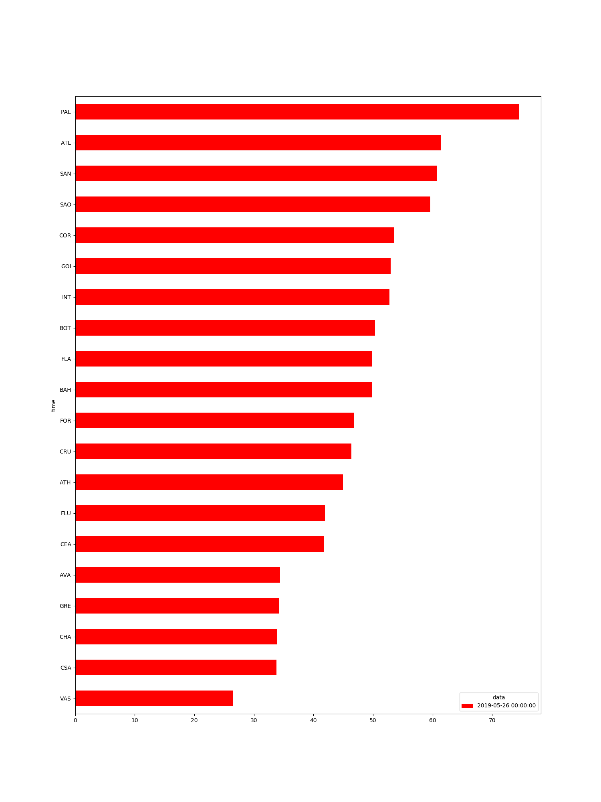
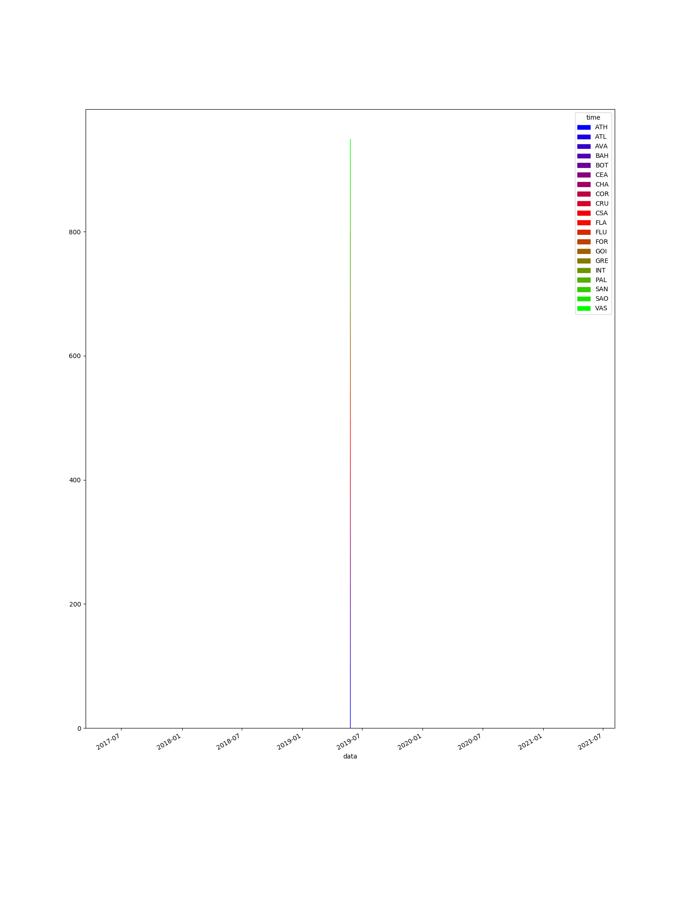
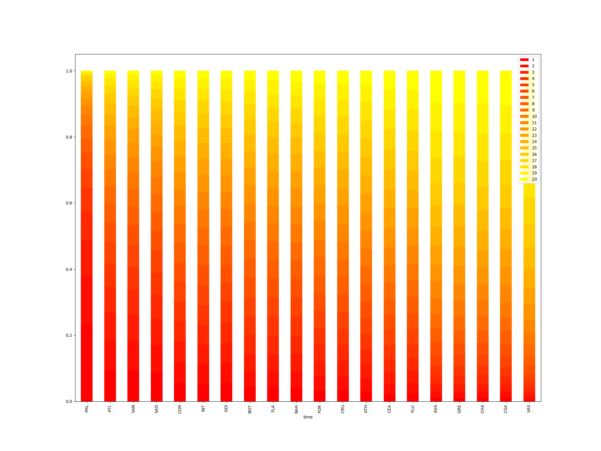

# brasileirao

We are downloading the results from Brazilian National Soccer Championship ("Brasileirão") and simulating the results of future games.

- We consider the advange of playing home.
- We use Poisson distribution to guess the match score.

