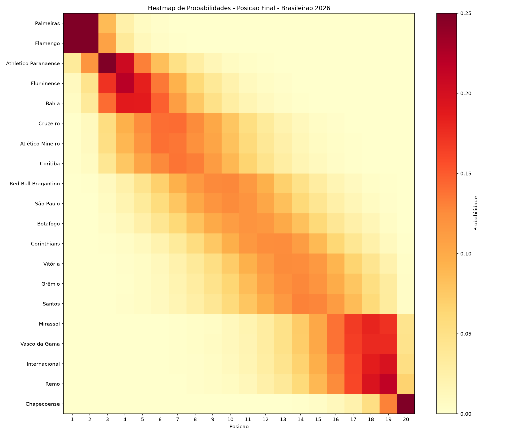
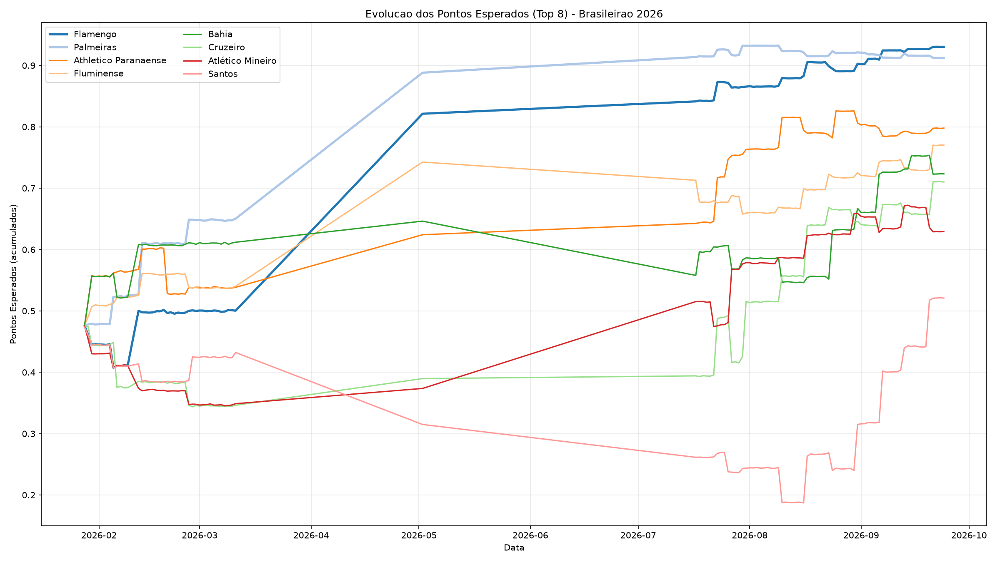
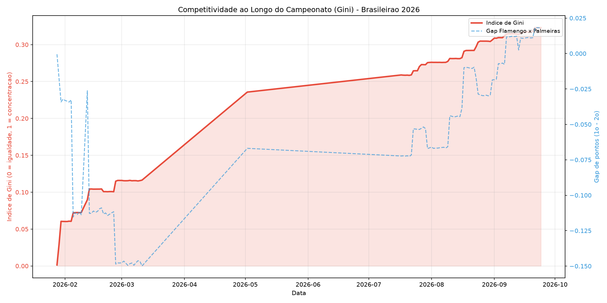
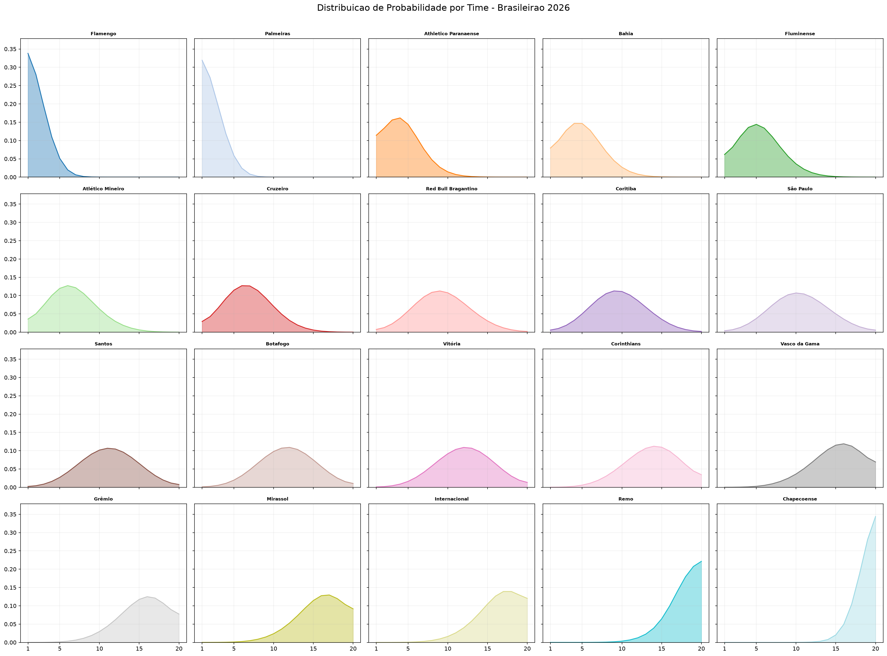
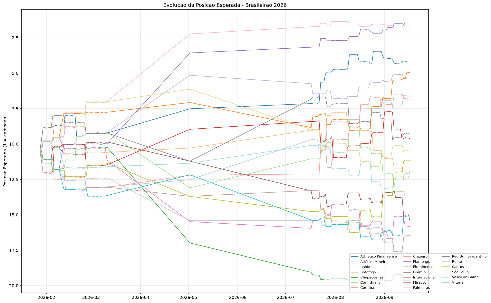
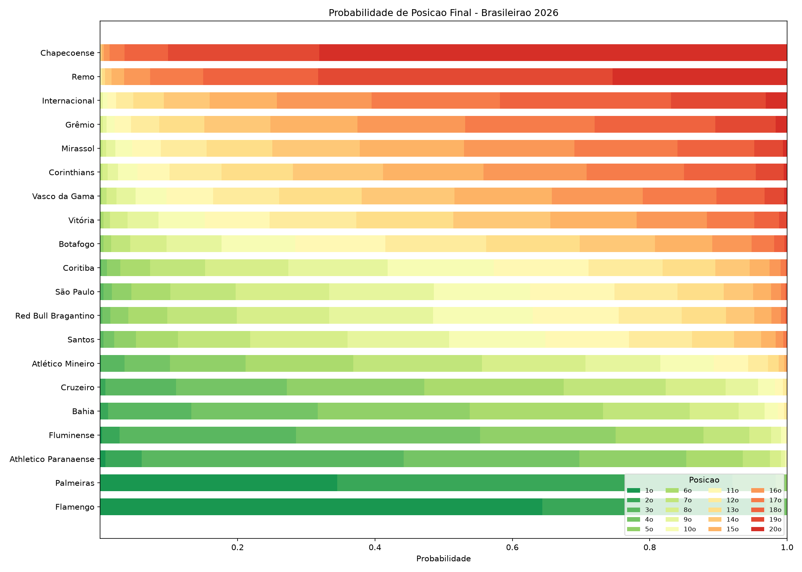

# Brasileirao - Monte Carlo Simulation

Simulacao estatistica do Campeonato Brasileiro de Futebol (Serie A) usando **Monte Carlo** com distribuicao de Poisson para prever resultados de jogos futuros e probabilidades de classificacao.

## Metodologia

### Coleta de Dados
- Dados obtidos em tempo real via API da **CBF** (Confederacao Brasileira de Futebol)
- 38 rodadas, 20 times, 380 jogos por temporada
- Resultados ja disputados sao utilizados como dados reais

### Modelo de Simulacao
- **100.000 simulacoes** por execucao (vetorizadas com NumPy)
- Jogos futuros simulados com **distribuicao de Poisson**:
  - Mandante: lambda = 2 (vantagem de jogar em casa)
  - Visitante: lambda = 1
- Sistema de pontuacao: Vitoria = 3pts, Empate = 1pt, Derrota = 0pts
- Criterios de desempate: vitorias -> saldo de gols -> ruido aleatorio

### Automação
- Execucao diaria via **GitHub Actions** (cron: 01:00 UTC)
- Atualizacao automatica dos dados e graficos
- Commit e push automatico dos resultados

---

## Resultados - Temporada 2026 (em andamento)

### 1. Heatmap de Probabilidades (Posicao Final)


**Como interpretar:** Cada linha e um time, cada coluna e uma posicao final (1o a 20o). A cor indica a probabilidade do time terminar naquela posicao. **Quanto mais escuro (vermelho), maior a chance.** Times concentrados em uma unica coluna tem o destino mais definido; times com cores espalhadas tem resultado incerto. Os times estao ordenados pela posicao esperada (melhores em cima).

---

### 2. Corrida de Pontos Esperados (Top 8)


**Como interpretar:** Mostra a evolucao dos pontos esperados acumulados ao longo da temporada para os 8 times melhores classificados. **Linhas mais grossas** destacam o 1o e 2o colocados. A inclinacao da curva indica ritmo de pontuacao: uma curva mais inclinada significa que o time esta somando pontos mais rapido que os rivais. Convergencia entre linhas indica disputa acirrada; divergencia indica lider distante.

---

### 3. Indice de Gini - Competitividade


**Como interpretar:** O **Indice de Gini** mede a desigualdade na distribuicao de pontos entre os 20 times. Variando de 0 (todos iguais) a 1 (um time domina tudo):
- **Gini baixo (~0.0-0.1):** Campeonato equilibrado, muitos times proximos
- **Gini medio (~0.1-0.3):** Alguma concentracao nos primeiros colocados
- **Gini alto (>0.3):** Poucos times dominam, grande distanciamento do restante

A linha tracejada azul mostra o **gap de pontos entre o 1o e o 2o colocado**. Um Gini crescente com gap crescente indica uma lideranca se consolidando. Um Gini estavel indica que a classificacao nao esta mudando muito.

---

### 4. Distribuicao de Probabilidade por Time


**Como interpretar:** Cada painel e um time, mostrando a distribuicao de probabilidade ao longo das 20 posicoes. **Curvas mais estreitas e altas** indicam maior certeza de uma posicao especifica. **Curvas largas e achatadas** indicam incerteza (o time pode cair em varias posicoes). O pico da curva indica a posicao mais provavel. Times na parte superior sao os melhores classificados (ordenados pela posicao esperada).

---

### 5. Evolucao da Posicao Esperada


**Como interpretar:** Cada linha e um time, mostrando sua posicao esperada ao longo do tempo. **Eixo Y invertido**: 1o lugar no topo, 20o na base. Movimentos para cima indicam melhora de desempenho; movimentos para baixo indicam piora. Linhas que se cruzam mostram quando um time ultrapassou outro na expectativa. No inicio do campeonato as linhas sao agitadas (poucos dados); no fim, estabilizam.

---

### 6. Probabilidade de Posicao Final (Barra Empilhada)


**Como interpretar:** Cada barra horizontal e um time, mostrando a probabilidade acumulada de terminar em cada posicao. **Cores quentes (vermelho/laranja)** = posicoes altas (1o-5o). **Cores frias (verde/amarelo)** = posicoes baixas. Um time com barra predominantemente vermelha tem altas chances de titulo. Um time com barra mista tem resultado incerto. A ordenacao e por posicao esperada (melhores em cima).

---

## Temporadas Anteriores

### 2025


### 2024


### 2023


### 2022


### 2021


### 2020


### 2019


### 2018


### 2017


---

## Estrutura do Projeto

```
brasileirao/
├── brasileirao_2026.py              # Script principal (temporada atual)
├── brasileirao_2026.txt             # Resultados (formato curto)
├── brasileirao_long_2026.txt        # Resultados (formato longo)
├── figs/                            # Graficos gerados (6 por temporada)
├── _old/                            # Scripts historicos e dados (2017-2025)
├── .github/workflows/               # Automacao via GitHub Actions
├── requirements.txt                 # Dependencias Python
├── Dockerfile                       # Container para execucao local
└── README.md
```

## Tecnologias

- **Python 3.11** - Linguagem principal
- **NumPy** - Distribuicao de Poisson, operacoes numericas e simulacao vetorizada
- **Pandas** - Manipulacao e analise de dados
- **Matplotlib** - Visualizacoes
- **SciPy** - Suavizacao de curvas (Gaussian filter)
- **Requests** - Consumo da API da CBF
- **GitHub Actions** - Automacao e agendamento

## Como Executar

### Localmente
```bash
pip install -r requirements.txt
python brasileirao_2026.py
```

### Via Docker
```bash
docker build -t brasileirao .
docker run brasileirao
```

## Licenca

Projeto para fins educacionais e de analise estatistica.
