# brasileirao

We are downloading the results from Brazilian National Soccer Championship ("Brasileirão") and simulating the results of future games.

- We consider the advange of playing home.
- We use Poisson distribution to guess the match score.

## 2025 (under development)
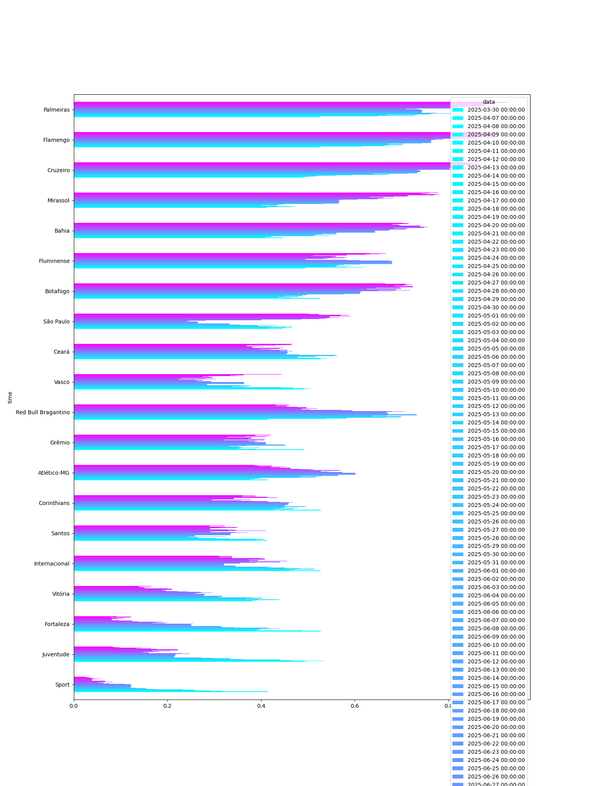
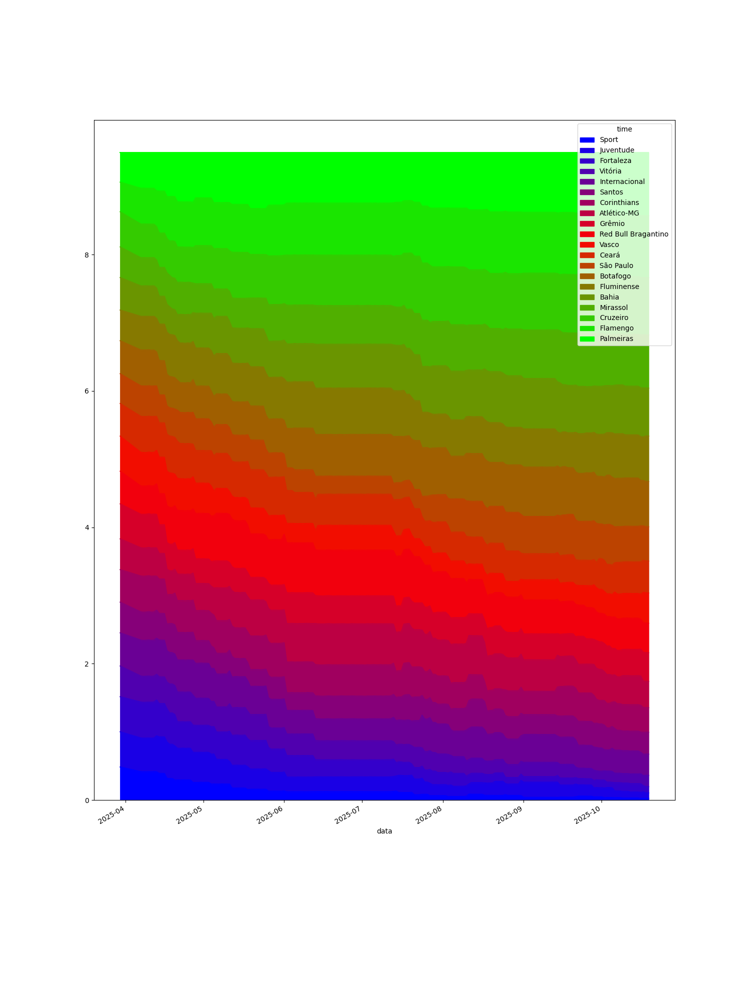
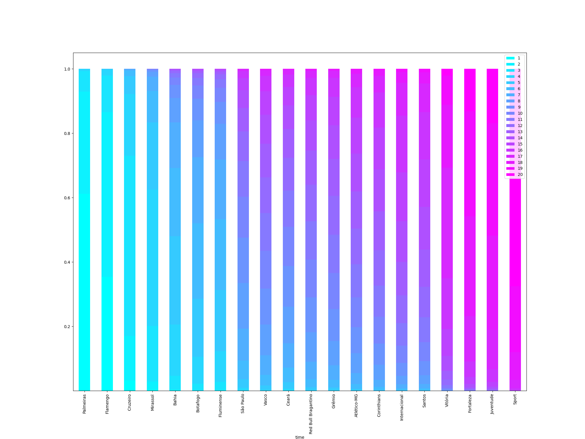
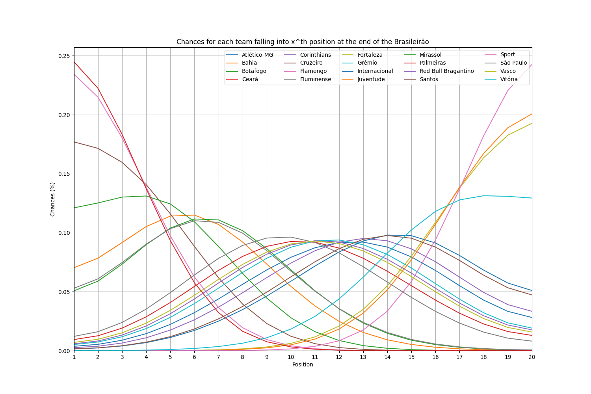

## 2024
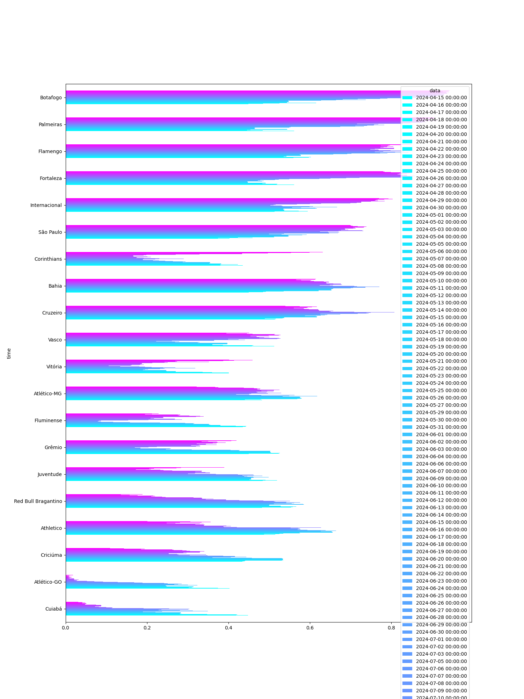
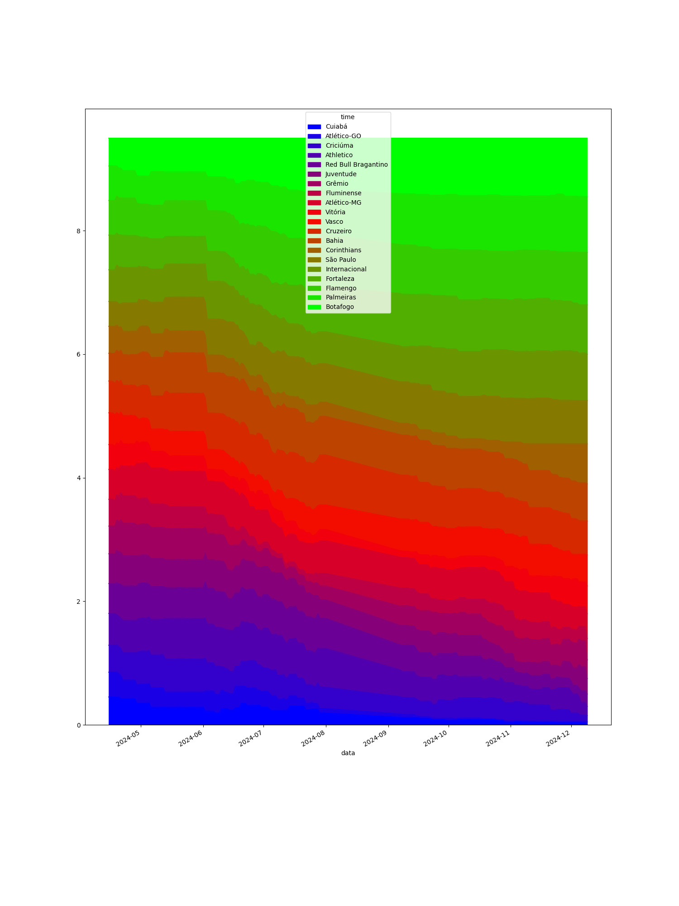
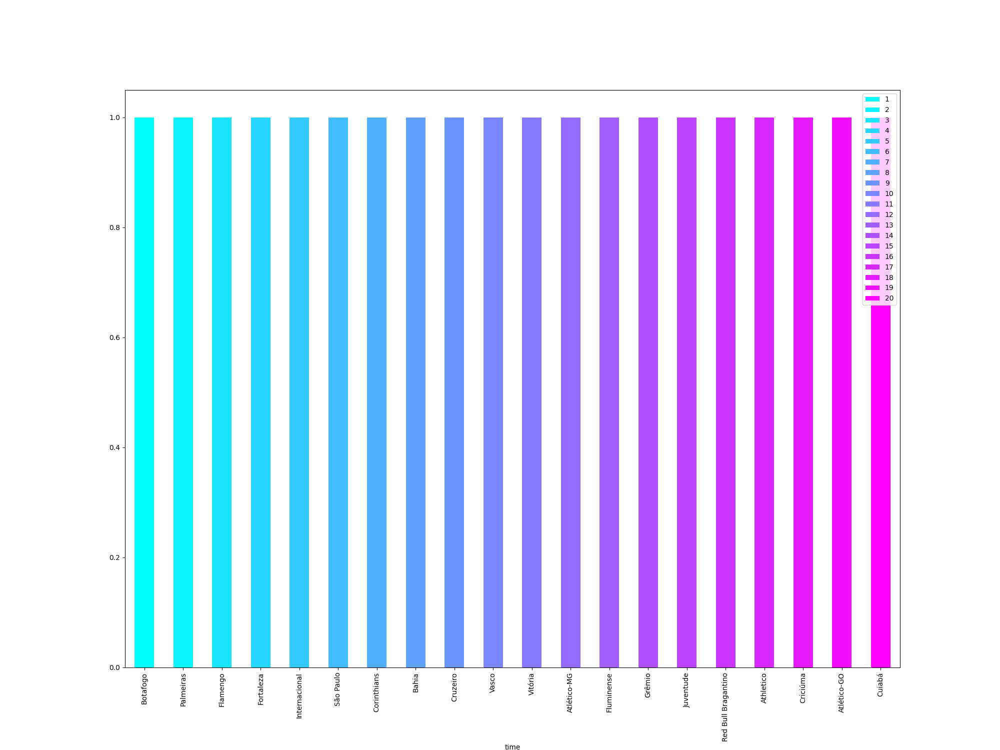
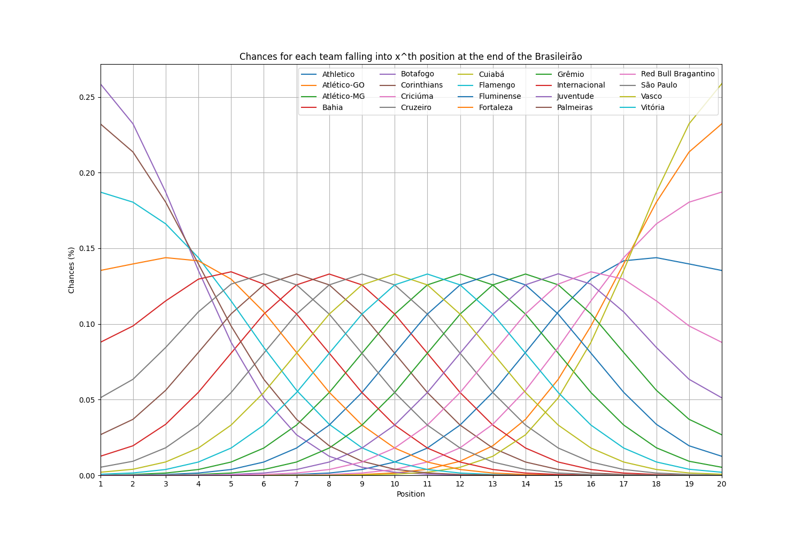

## 2023
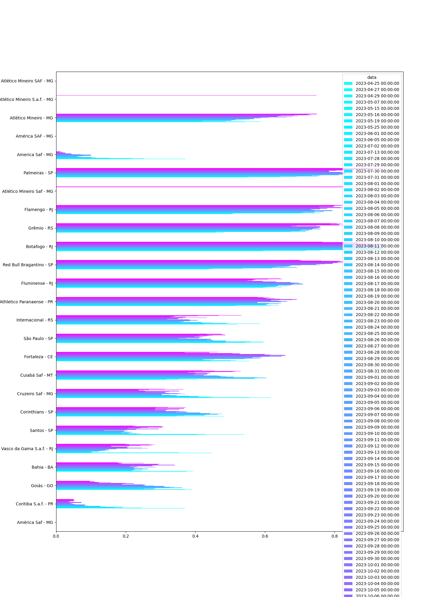
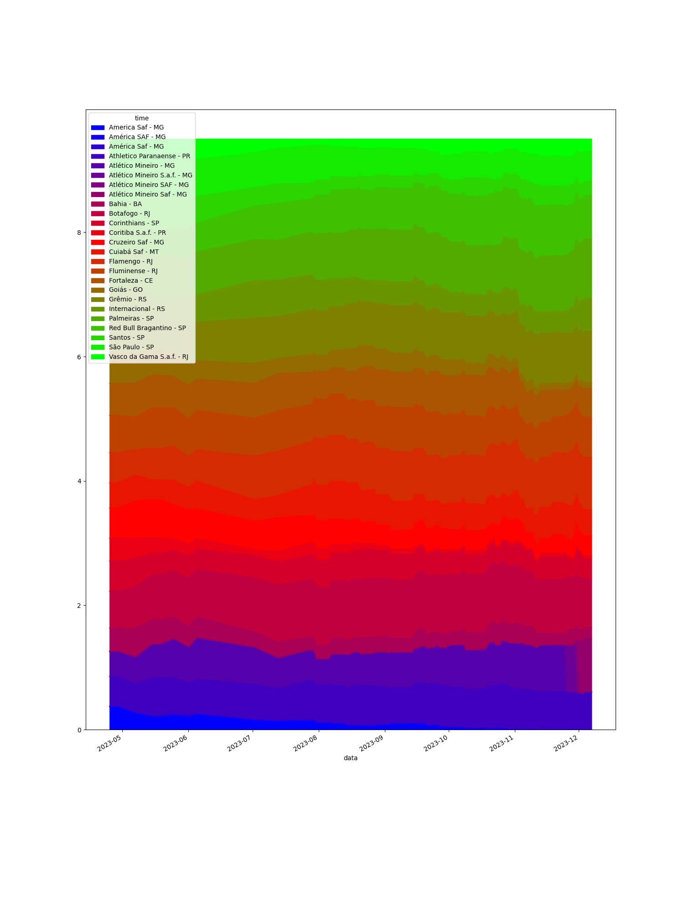

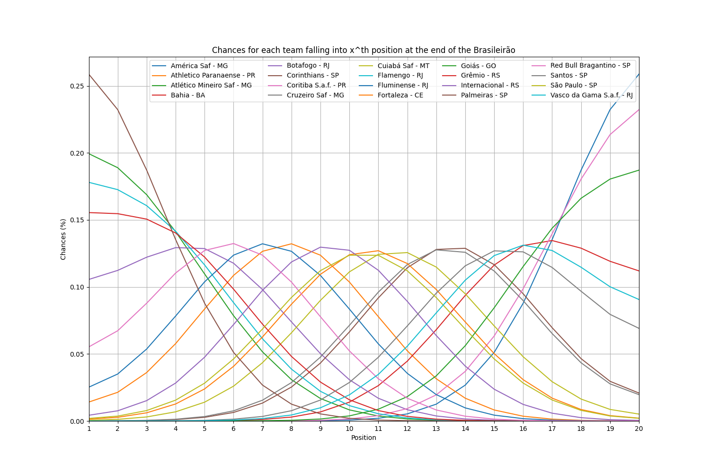

## 2022 

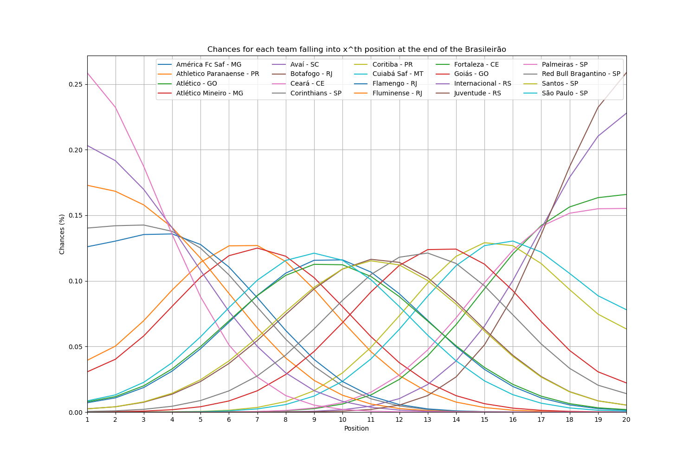

## 2022 

## 2020
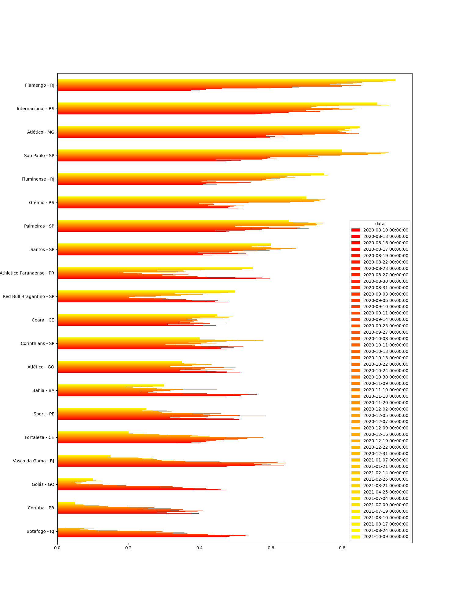

## 2019 

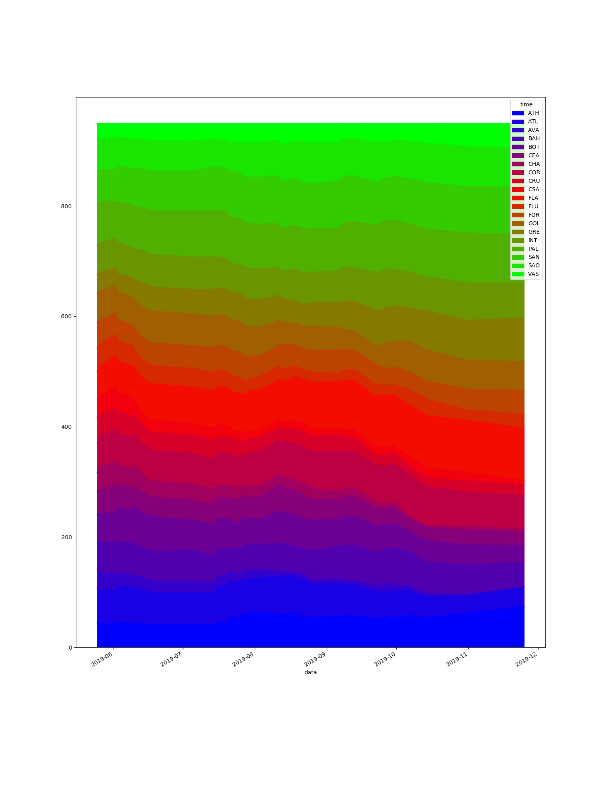

## 2018

## 2017

